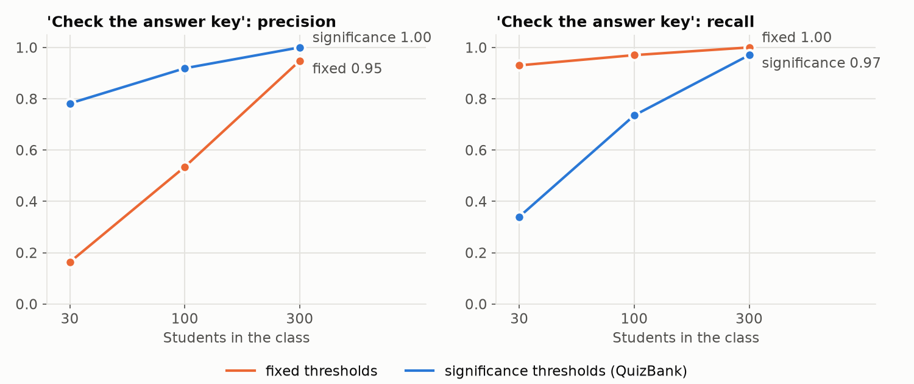
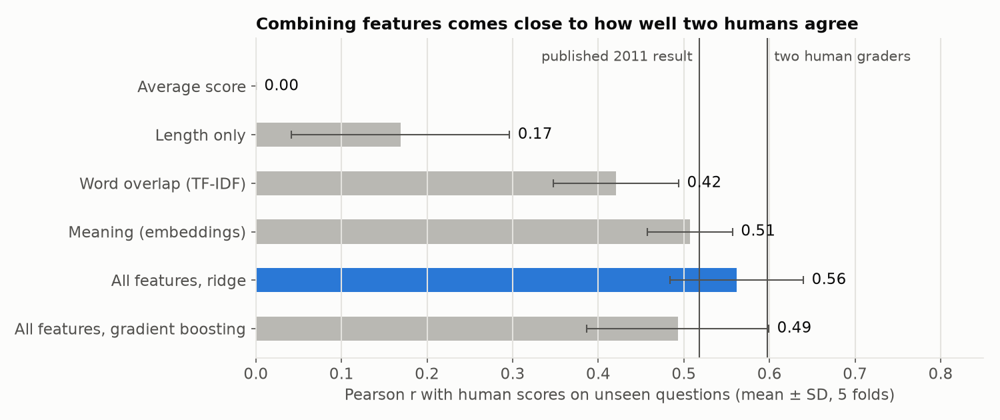

# quizbank-ai

A question bank for instructors: import quizzes from Canvas, give them to students online with automatic grading, and use data science and machine learning to find broken questions, suggest scores for written answers, and group questions by topic.

This is a rework of **QuizPress**, a CS senior design project. The original team built a Django app that converts Canvas quizzes into printable tests. This version keeps the part with the most lasting value, the Canvas importer and the question data model, and rebuilds it as a focused tool with a modern web interface, online quizzes, and measured ML features.

## Status

| Stage | What | Status |
|---|---|---|
| 1 | Clean foundation: Canvas QTI importer, data model, tests | ✅ Done |
| 2 | Web UI: dashboard, question bank with search, quiz pages, import from the browser | ✅ Done |
| 3 | Online quizzes: share links, automatic grading, results and essay grading | ✅ Done |
| 4 | Data science and ML: question analytics, AI score suggestions, topic tags, each evaluated | ✅ Done |

Ideas that weren't built: semantic search, duplicate detection, and LLM-generated questions.

## What works now

**Browse the bank in the browser.** Sign in at `http://127.0.0.1:8000/`. The design takes Canvas's structure (course cards on the dashboard, breadcrumbs, quiz questions laid out the way Canvas shows them) and draws it in a glass-and-glow style: a floating glass tab bar with a sliding highlight, glass panels over a slowly drifting color background, cards and rows that light up under the pointer, and the Geist font. Press ⌘K (Ctrl+K) anywhere to open a command palette that searches questions or jumps to a course. It follows the device's light or dark mode and works down to phone width.

- **Dashboard:** a card for each course.
- **Question bank:** every question, or one course's, with search and filters by question type.
- **Quizzes:** each quiz in order, with an **Answer key / Student view** switch.
- **Question pages:** the answer key, details, and the quizzes that use the question.
- **Import:** upload a Canvas export from the browser.

Editing is still done in the Django admin at `/admin/`.

**Import a Canvas quiz.** In Canvas, export a quiz as QTI (a `.zip`). Upload it on the Import page, or run:

```bash
python manage.py import_qti export.zip --course "CS 101" --course-name "Intro to Computing"
```

Supported question types: multiple choice, true/false, multiple selection, fill in the blank, and essay. Other types (matching, numerical, and so on) are imported with their text and flagged in a warning, so nothing is lost silently. Embedded images are extracted and saved with their question. Importing the same export into the same course twice is detected and skipped.

**Give a quiz to students, graded automatically.** On any quiz page, click **Give this quiz** to get a share link. Students open it, type their name, and take the quiz; no accounts needed. When they submit:

- Multiple choice and true/false get full points for the right answer.
- Multiple selection gets partial credit the way Canvas gives it: points are split across the right choices, each wrong choice takes a share back, and the score never drops below zero.
- Fill-in-the-blank answers match if they equal an accepted answer, ignoring capitalization and extra spaces.
- Essays wait for you. Grade them on each student's page and their score updates.

The results page shows every submission, the class average, how the class did on each question, and a CSV download. You choose whether students see the right answers after submitting, and you can close the link at any time. The page students take the quiz on never includes the answers; grading happens on the server.

## Data science and machine learning

Each feature is measured against real or known-answer data and simple baselines, in a notebook that reruns from scratch. The numbers below come from those notebooks.

### Question analytics: which questions are broken?

After students take a quiz, the **Analytics** page shows, for every question, how many points students earned (difficulty), whether strong students did better on it than weak ones (discrimination, as the item-rest correlation), which wrong answers the top and bottom 27% of students picked, and how reliable the quiz is overall (Cronbach's alpha and the standard error of measurement). It flags questions worth fixing, most importantly **"check the answer key"**: a question that strong students get "wrong" usually has the wrong answer marked right.

Real class data can't say which questions are actually broken, so [notebooks/02_question_analytics.ipynb](notebooks/02_question_analytics.ipynb) tests the statistics on **simulated classes** where the truth is known: students with abilities answering questions under a three-parameter IRT model, with planted problems (a miskeyed question, a dead distractor, a very easy question).

- A 2PL IRT model fit with PyTorch recovers the simulated question difficulties (r = 0.995) and discriminations (r = 0.95). The first version's scatter plots showed a scale problem the correlations hid; rescaling abilities to the model's scale fixed it (difficulty error 0.66 to 0.12).
- The classical statistics the app shows track the true parameters (Spearman rho = -0.97 for difficulty, 0.85 for discrimination).
- **Flag accuracy, over 200 simulated tests at each class size:**

| "Check the answer key" | 30 students | 100 students | 300 students |
|---|---|---|---|
| Precision with fixed cutoffs | 16% | 53% | 95% |
| Precision with significance tests (used) | **78%** | **92%** | **100%** |
| Recall with significance tests (used) | 34% | 73% | 97% |

With fixed cutoffs, most answer-key flags in small classes were noise. Requiring statistical significance made them trustworthy, at the cost of missing more real problems in small classes; those still show up as "weak" questions. The page warns that numbers from fewer than 20 students are unreliable.

`python manage.py simulate_class <quiz id>` fills a quiz with a clearly labeled simulated class, with one question secretly miskeyed, so the analytics page can be demonstrated.



### AI score suggestions for written answers

On the grading page, each written answer gets an **AI suggestion** that the instructor accepts with one click or overrides. The model compares the student's answer with the question's model answer: similarity in meaning (MiniLM sentence embeddings), word overlap (TF-IDF), coverage of the model answer's key words, and length, combined with ridge regression.

[notebooks/01_essay_grading.ipynb](notebooks/01_essay_grading.ipynb) trains and tests it on the UNT computer science short-answer dataset: 2,273 real student answers to 81 questions, each scored 0-5 by two human graders. Evaluation is **5-fold cross-validation grouped by question**, so the model is always scored on questions it never saw, as it would be in the app.

| Model (held-out questions) | Pearson r | QWK | Mean abs. error |
|---|---|---|---|
| Always predict the average | 0.00 | 0.00 | 0.89 |
| Answer length only | 0.17 | 0.00 | 0.87 |
| Word overlap (TF-IDF) | 0.42 | 0.20 | 0.76 |
| Meaning (embeddings) | 0.51 | 0.35 | 0.73 |
| **All features, ridge (used)** | **0.56** | **0.43** | **0.68** |
| All features, gradient boosting | 0.49 | 0.44 | 0.70 |
| *Two human graders vs each other* | *0.60* | *0.49* | *0.75* |
| *Published result on this dataset (Mohler et al., 2011)* | *0.518* | | |

The suggestions land within 1 point of the human score 76% of the time. **The main weakness:** they measure similarity, not correctness, so short wrong answers get too much credit (answers humans scored 0 averaged 2.9 of 5). The grading page says so next to the suggestions, and the instructor always decides.

To enable suggestions, run `python manage.py train_essay_grader` (downloads the dataset and model, about a minute) and give essay questions a **model answer** in the admin. The demo essays already have one.



### Automatic topic tags

**Find topics** on a course page groups its questions by meaning and tags each one; the topic chips then filter the course. Questions are embedded with MiniLM, clustered with k-means with the number of topics chosen by silhouette score, and each topic is named by its most distinctive words (class-based TF-IDF).

[notebooks/03_topic_tags.ipynb](notebooks/03_topic_tags.ipynb) measures this on MMLU questions whose true subject is known (10 random subjects x 100 questions, 3 trials):

| Method | Agreement with true subjects (NMI) | ARI |
|---|---|---|
| **MiniLM + k-means (used)** | **0.75** | **0.67** |
| MiniLM + k-means, number of topics chosen automatically | 0.74 | 0.65 |
| TF-IDF + k-means | 0.34 | 0.12 |
| MiniLM + HDBSCAN | 0.19 | 0.05 |
| LDA | 0.13 | 0.08 |

The median topic is 91% one subject. Choosing the number of topics automatically found the true 10 in two of three trials. `python manage.py load_sciq` imports 1,000 SciQ science questions as a demo course big enough for topics to be interesting, and `python manage.py build_topics` groups any course from the command line.

### Reproducing the notebooks

```bash
pip install -r requirements-dev.txt
python manage.py train_essay_grader
jupyter nbconvert --to notebook --execute --inplace notebooks/01_essay_grading.ipynb
jupyter nbconvert --to notebook --execute --inplace notebooks/02_question_analytics.ipynb
jupyter nbconvert --to notebook --execute --inplace notebooks/03_topic_tags.ipynb
```

Datasets download into `data/` on first use and are never committed. Each notebook is generated by a `build_*.py` script next to it; all the logic lives in `bank/ml/`, which the app and the tests share.

## Setup

```bash
python3 -m venv .venv
source .venv/bin/activate
pip install -r requirements.txt

export DJANGO_DEBUG=1
python manage.py migrate
python manage.py createsuperuser
python manage.py load_demo_data
python manage.py runserver
```

`DJANGO_DEBUG=1` is for local development only, and it lasts for the current terminal session. `load_demo_data` is optional: it adds three sample courses to explore the site with, and you can delete them in the admin afterwards.

The machine learning features are optional too. `python manage.py train_essay_grader` turns on AI score suggestions, `python manage.py load_sciq` adds a larger demo course, and `python manage.py simulate_class <quiz id>` gives a quiz to a simulated class for the analytics page. The first use downloads a small embedding model (about 90 MB).

Settings come from environment variables; see `.env.example`. Outside of debug mode the app refuses to start without `DJANGO_SECRET_KEY`.

## Tests

```bash
DJANGO_DEBUG=1 python manage.py test bank
```

The tests build Canvas-style exports and dataset files in memory, use a temporary data folder, and swap the embedding model for an offline stand-in, so they need no downloads or network access.

## Public demo

The `Dockerfile` builds a self-contained demo: it trains the essay grader, then creates a database with the sample courses, the SciQ course with topic tags, a simulated class on the first CS 101 quiz for the analytics page, a sample class of eight students on the same quiz whose written answers are waiting to be graded (with the AI suggestions already computed), and a shared `demo` account whose password is shown on the sign-in page. The demo account is a regular user, so it can use every page but not the admin. Every container starts from that same database, so the demo resets whenever it restarts.

It runs on a Hugging Face Space (Docker, which needs a PRO account; 2 CPUs, 16 GB of memory, enough for PyTorch and the embedding model). To try the image locally:

```bash
docker build -t quizbank-demo .
docker run -p 7860:7860 quizbank-demo    # then open http://localhost:7860
```

To publish the committed code to the Space (it rebuilds in about 10 minutes):

```bash
hf auth login                                    # once, with a Hugging Face write token
python deploy/push_to_space.py rmill/quizbank-ai
```

`deploy/start.sh` reads the public hostname Hugging Face provides and sets the allowed host, trusted origin, and HTTPS cookie settings from it. Without a `DJANGO_SECRET_KEY` secret it makes a random one on each start. Images inside imported Canvas quizzes aren't shown in the demo, because Django doesn't serve uploaded files when `DEBUG` is off.

## What changed from QuizPress

- **The importer is now a standalone module** (`bank/qti.py`) with no Django dependency, covered by tests.
- **Import bugs fixed:**
  - Question metadata is read by label rather than by position, so exports with fields in a different order still import.
  - The importer no longer sets fields that don't exist on the model, which crashed every import.
  - Correct answers come from the scoring rule, not from Canvas's per-answer feedback rules.
- **Imports are all-or-nothing.** A bad file writes nothing to the database.
- **No secrets in the code.** Credentials and keys come from environment variables. Uploaded XML is parsed with `defusedxml`.
- **Slimmed down.** The publisher, template, cover-page, and feedback features and their dashboards were dropped to keep the project focused.

## Credits

QuizPress was built by the SPG8 senior design team: Amadeus Grimm, garynino, dafearn, and Reece Milligan. The original data model and Canvas importer this project builds on are their work. Original repository: [dafearn/SPG8fearn](https://github.com/dafearn/SPG8fearn).

The rework is by Reece Milligan.

Icons are from [Ionicons](https://ionic.io/ionicons) (MIT License). The [Geist](https://vercel.com/font) fonts are included under the SIL Open Font License (`bank/static/bank/fonts/OFL.txt`).

Datasets and models, downloaded on first use and not redistributed here:

- **UNT Computer Science Short Answer dataset:** Michael Mohler, Razvan Bunescu, and Rada Mihalcea. "Learning to Grade Short Answer Questions using Semantic Similarity Measures and Dependency Graph Alignments." ACL 2011.
- **MMLU:** Dan Hendrycks et al. "Measuring Massive Multitask Language Understanding." ICLR 2021. MIT License.
- **SciQ:** Johannes Welbl, Nelson F. Liu, and Matt Gardner. "Crowdsourcing Multiple Choice Science Questions." 2017. CC BY-NC 3.0.
- **all-MiniLM-L6-v2** sentence embedding model from [sentence-transformers](https://www.sbert.net/). Apache 2.0.
